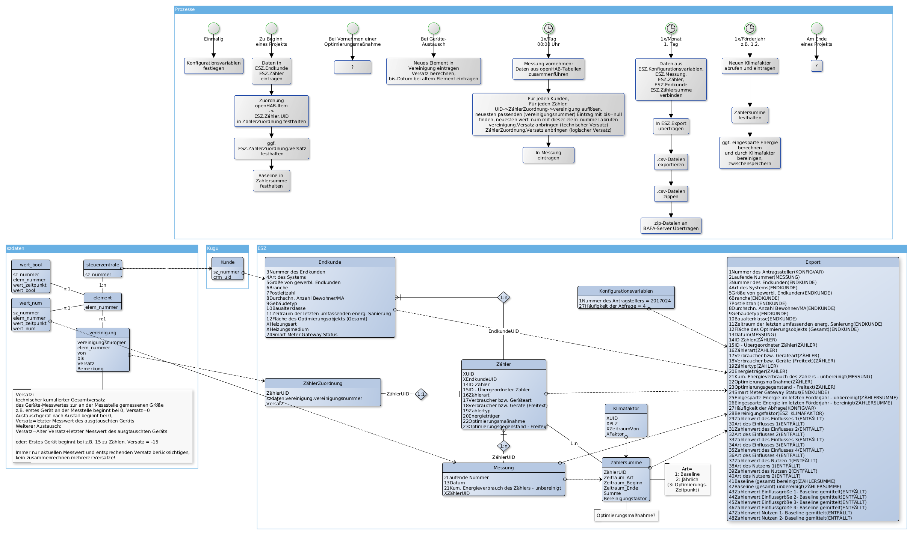

# ESZ-Exporter - Einsparzähler-Nachweisdaten-Export

Dieses Programm generiert aus den intern bei Kugu gespeicherten Daten der Feldsysteme ("Steuerzentrale") Dateien im Format, wie es vom [Pilotprogramm Einsparzähler des BAFA](http://www.bafa.de/DE/Energie/Energieeffizienz/Einsparzaehler/einsparzaehler_node.html) für den Fördernachweis gefordert wird. Das Programm ist in [Go](https://golang.org/) geschrieben, was eine sehr leichte Cross-Compilierung und Portierung für alle gängigen Betriebssyteme (Linux, Windows, macOS, ...) und Plattformen (x86, arm, ...) erlaubt.

Da das Programm ursprünglich für den internen Gebrauch bei Kugu entwickelt wurde, dürften Änderungen für den Einsatz innerhalb anderer unternehmensinterner Datenstrukturen nötig sein. Der Einsatz erfolgt auf eigene Gefahr und unter Ausschluß von Haftung oder anderen Rechtsansprüchen.

Wir bemühen uns, Fragen per GitHub-Issue zügig zu beantworten, bitten aber um Verständnis, dass wir keinen regelrechten Support oder Änderungs-Implementierungen leisten können. Pull Requests mit Fehlerbehebungen oder zusätzlichen Features (sofern allgemein für die ESZ-Teilnehmer sinnvoll) werden wir aber gerne aufnehmen.

## Vorbedingungen

Das Programm benötigt eine PostgreSQL-Datenbank, aus der die rohen Messdaten abgerufen werden können. Das zugrundeliegende Datenmodell kann  entnommen werden, es gibt ein [Beispiel-SQL-Script](doc/postgresql-datenstruktur.sql) für PostgreSQL.

## Programmübersetzung

```
GOPATH="$GOPATH:`pwd`" go build esz-exporter
```

Wichtig: Die GOPATH-Variable muss gesetzt sein, auch im Shell-Profil.


## Programmausführung

Testlauf für Entwickler:

```
./compileandrun
```

Programmparameter ansehen:

```
./esz-exporter -h
```

Beispiel-Aufruf:
```
./esz-exporter -dbbenutzer hwagner -modus exportieren -pfad ../export
```

Verpflichtend ist der Betriebsmodus, die restlichen Werten können optional gesetzt werden.

## Upload der generierten Daten

mit dem folgenden Skript ist ein Upload der Daten möglich:

```
#!/bin/bash

if [ $# != 1 ]
then
	echo "Parameter: $0 <esz-zipdatei-pfad>"
	exit 1
fi


curl -v -A "KEY=GEHEIMERKEY" -F "data=@$1" https://m2m.test.esz-verwendungsnachweis.de/services/import-esz/validate.php -o /dev/stdout

# erst "import" benutzen, wenn "validate" ohne Probleme durchläuft
# curl -v -A "KEY=GEHEIMERKEY" -F "data=@$1" https://m2m.test.esz-verwendungsnachweis.de/services/import-esz/import.php -o /dev/stdout
```

Dabei muss `GEHEIMERKEY` durch den von der BAFA bereitgestellten Schlüssel ersetzt werden.

Nach dem ersten Upload muss dann manuell durch die BAFA der Einsprungpunkt gesetzt werden, damit die hochgeladenen Daten unter https://www.test.esz-verwendungsnachweis.de/home2/vis/# sichtbar werden. Spätere Uploads werden dann automatisch sichtbar.

## Nutzungshinweise / Usage Notes

Einige Hilfen für eine typische Nutzung:

* Save credentials into environment variables at `/tmp/.env`
* Invoke the binary using the credentials from the environment variables with the following options  
  ```sh
  source /tmp/.env
  ./esz-exporter \
      -debug \
      -dbbenutzer $ZK_PG_USER \
      -dbpasswort $ZK_PG_PASS \
      -modus [messung|aufholen|exportbefüllen|exportieren|zählersumme] \
      -pfad /tmp/export \
      -kunde 3 \
      -dbadresse localhost
  ```
* `localhost` can be used if the port of a remote database is forwarded to the local machine via SSH
* Common issues
	+ make sure the `-pfad` target exists
	+ check the log at `tail -f /var/log/syslog` for details.
